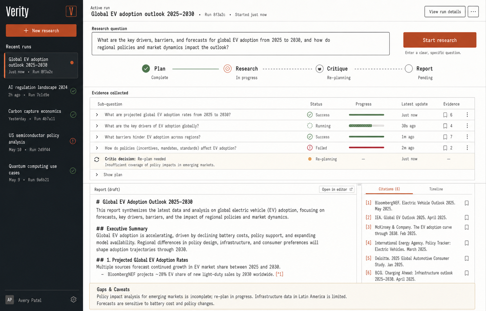
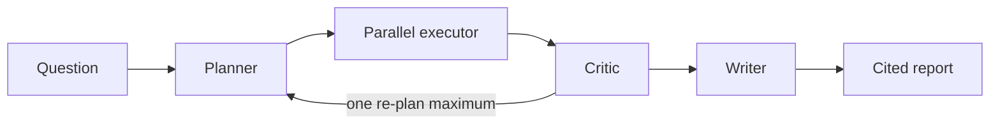

# Verity

Verity is an evidence-first autonomous research agent built with Python, FastAPI, and Next.js, with SQLite persistence today and an optional Supabase-ready Postgres adapter. It plans a question, researches independent sub-questions concurrently, critiques coverage and contradictions, performs at most one corrective re-plan, and writes a cited report that always exposes gaps.



## Why this exists

This repo demonstrates orchestration and evaluation engineering, not an agent-framework wrapper. There is no LangGraph, AutoGen, CrewAI, or external job queue. Typed Pydantic boundaries, explicit state transitions, bounded `asyncio` concurrency, durable snapshots, and SSE events make execution inspectable.



The detailed design is in [docs/ARCHITECTURE.md](docs/ARCHITECTURE.md), implementation judgments are recorded in [docs/DECISIONS.md](docs/DECISIONS.md), and [docs/PORTFOLIO.md](docs/PORTFOLIO.md) contains resume bullets and a concise interview/demo narrative.

## Current implementation

- Python planner → executor → critic → writer FSM with a code-enforced one-re-plan maximum.
- Bounded `asyncio` executor; 25-second sub-question deadlines; one provider-directed retry for transient errors.
- Keyless self-hosted SearXNG search, five-page retrieval, SSRF-aware fetching, Beautiful Soup extraction, and source-specific summaries; Brave remains optional.
- Groq primary and Gemini fallback behind one interface; JSON-mode plus validation/retry for structured stages.
- Partial sub-question failures survive into critic input, persisted trace data, SSE events, and report caveats.
- SQLite run snapshots and append-only events, plus an optional Supabase-ready Postgres adapter and locked private-schema migration.
- Next.js live workspace with progress stages, evidence outcomes, re-plan visibility, source rail, and cited Markdown.
- Deterministic trust gate (`verified`, `qualified`, or `inconclusive`) that can override an overconfident critic decision when evidence is thin, missing, failed, or entirely partial.
- Interactive Evidence Ledger with retained page excerpts, source classification, quality heuristics, plan rationale, search queries, and claim-scope warnings.
- Append-only run timeline, stage/provider telemetry, no-re-plan comparison view, source inspector, shareable run URLs, and Markdown/JSON/PDF exports.
- Bounded run queue, cancellation/retry/deletion APIs, optional bearer protection, per-client creation limits, a 30-minute evidence cache, and async SQLite/Postgres adapters.
- Reproducible HotpotQA baseline/ablation/critic benchmark scripts with resumable JSONL output.

## Run locally

Prerequisites: Docker for the full stack. Only a Groq key is needed for a research run; Gemini is an optional LLM fallback and search needs no API key.

```bash
cp .env.example .env
# Set GROQ_API_KEY in .env when you have it.
docker compose up --build
```

Open `http://localhost:3000`. The backend is at `http://localhost:8080`; `GET /health` is the readiness probe.

For process-level development:

```bash
docker compose up -d searxng
cd backend && python -m venv .venv && python -m pip install -r requirements-dev.txt
cd backend && python -m uvicorn verity.app:app --reload --port 8080
cd frontend && npm install && npm run dev
```

The local SearXNG JSON API is bound to `127.0.0.1:8888`, and the backend reaches it at `http://searxng:8080` inside Compose. Its tracked configuration enables DuckDuckGo and Bing browser-search engines. Do not commit LLM keys. The server can boot without one so health checks and the UI work, but a research run will fail with a clear LLM provider error until you add Groq or Gemini.

To use Brave instead, set `VERITY_SEARCH_PROVIDER=brave` and add `BRAVE_SEARCH_API_KEY`. Its current $0.005/request estimate is selected automatically unless `VERITY_SEARCH_COST_PER_QUERY` overrides it. Provider selection does not alter orchestration code.

## API

```text
POST /api/runs
  { "question": "..." }
  -> { "run_id": "..." }

GET /api/runs/{run_id}/stream
  plan_created | subquestion_started | subquestion_completed |
  subquestion_failed | critic_decision | replan_started |
  report_completed | run_failed

GET /api/runs/{run_id}
GET /api/runs?limit=20
GET /api/runs/{run_id}/events
POST /api/runs/{run_id}/cancel
POST /api/runs/{run_id}/retry
DELETE /api/runs/{run_id}
GET /api/status
```

`POST /api/runs` also accepts `replan_enabled: false` for the evaluation ablation. The UI can launch either mode or both modes together. Set `VERITY_API_TOKEN` to require a bearer token on shared deployments; local development leaves it blank. This shared-token option is a deployment guard, not a replacement for an identity provider in a multi-tenant product.

## Trust and evidence contract

Verity does not treat LLM self-critique as a sufficient safety boundary. After each critic response, deterministic code forces a re-plan when any planned area is thin or missing, any evidence path failed, or no evidence path fully succeeded. Once the one-re-plan limit is reached, the run may still produce a useful report, but its trust state becomes `inconclusive` and the writer must abstain from a confident numeric answer.

Every new source record retains its domain, a deterministic extracted-text excerpt, retrieval time, a transparent heuristic source type, and a quality score. These scores are interface cues rather than factual reliability guarantees; reviewers can open the original page and inspect the actual excerpt.

## Production deployment

SQLite is the current runtime and zero-setup default. The repository also supports optional Supabase Postgres through `VERITY_DATABASE_URL`; when configured, the application writes only to the private `verity` schema created by the tracked migration in `supabase/migrations`. Use the Supavisor session-pooler connection string for persistent IPv4 hosts. No Verity Supabase project is currently provisioned, so the deployed application does not use this optional path. `VERITY_MAX_ACTIVE_RUNS` bounds concurrent runs while additional work remains queued. Creation is limited to ten runs per client address per minute.

The Next.js route handler proxies API and SSE traffic server-side, so Vercel stores `VERITY_API_URL` and `VERITY_API_TOKEN` without exposing either to the browser. A genuinely multi-user product should still replace the shared deployment token with user authentication, authorization, and per-user quotas.

## Benchmark

The committed report is intentionally unfilled until a real run is performed. No credentials are available in this repository, so publishing numbers now would fabricate results. In addition to HotpotQA, `eval/datasets/research_quality.jsonl` contains adversarial research prompts covering abstention, metric substitution, denominator ambiguity, causal overclaiming, conflicting forecasts, and high-stakes guarantees. A single live [adversarial smoke result](eval/results/research_quality_smoke.md) demonstrates the end-to-end abstention and corrective re-plan path without presenting it as benchmark evidence.

| Metric | Baseline | Verity (no re-plan) | Verity (critic re-plan) |
|---|---:|---:|---:|
| Completed runs | 0 | 0 | 0 |
| Accuracy (exact / partial) | NOT RUN / NOT RUN | NOT RUN / NOT RUN | NOT RUN / NOT RUN |
| Token F1 | NOT RUN | NOT RUN | NOT RUN |
| Avg wall-clock latency | NOT RUN | NOT RUN | NOT RUN |
| Avg estimated cost/query | NOT RUN | NOT RUN | NOT RUN |
| Avg sources cited | NOT RUN | NOT RUN | NOT RUN |
| Critic detected contradiction | — | NOT RUN | NOT RUN |
| Avg deterministic trust score | — | NOT RUN | NOT RUN |
| Citation index validity | — | NOT RUN | NOT RUN |
| Numeric claims with citations | — | NOT RUN | NOT RUN |
| Avg independent domains | — | NOT RUN | NOT RUN |
| Abstention accuracy | — | NOT RUN | NOT RUN |

To produce the table from raw evidence:

```bash
cd eval
python download_hotpot.py --size 100 --seed 42
python run_baseline.py
python run_agent_eval.py --variant no_replan --output results/no_replan.jsonl
python run_agent_eval.py --variant critic_replan --output results/critic_replan.jsonl
python score.py
```

The official [HotpotQA dev-distractor set](https://hotpotqa.github.io/) is sampled deterministically. Scripts resume by ID, preserve failures, and generate `eval/results/benchmark_report.md` plus machine-readable summaries. Exact match and token F1 use normalized SQuAD-style scoring; the custom partial-match rule is disclosed in the report.

## Cost and provider reality (verified 2026-07-17)

Provider offerings have drifted since the PRD, so the default search path is now self-hosted:

- [Groq lists Llama 3.1 8B Instant](https://console.groq.com/docs/model/llama-3.1-8b-instant) with JSON object mode, low pricing, and a 500K-token daily free-tier limit. It is Verity's default model; `GROQ_MODEL` remains configurable. Research summaries run serially by default (`VERITY_CONCURRENCY=1`), use bounded prompt sizes, and retry transient limits using Groq's provider-directed delay.
- [Gemini 2.0 Flash was shut down](https://ai.google.dev/gemini-api/docs/deprecations) on 2026-06-01. The default fallback is Google's recommended `gemini-3.5-flash`; its free tier is $0 while its paid estimate is $2.70/M input and $16.20/M output.
- [SearXNG's supported container setup](https://docs.searxng.org/admin/installation-docker.html) and [JSON search API](https://docs.searxng.org/dev/search_api.html) provide keyless local metasearch. Verity runs a pinned official image and explicitly enables JSON output.
- [Brave's current Search plan](https://api-dashboard.search.brave.com/documentation/pricing) costs $5/1,000 requests, includes $5 monthly credit, and requires a card for verification. It remains optional rather than the default.
- [Tavily's free plan](https://docs.tavily.com/documentation/api-credits) provides 1,000 credits/month without a card, but adds another key and still caps demo traffic, so it was not selected.

Self-hosted SearXNG has no per-query API price, so an illustrative paid-tier estimate at 50k Groq input tokens and 6k output tokens per run is **$34.24 per 1,000 runs**, plus compute and bandwidth. The benchmark replaces those assumptions with measured usage. Zero search spend does not guarantee unlimited reliability: upstream browser-search engines can throttle or change markup, and Verity records those failures as partial evidence.

Local Docker hosting is recurring-cost free. The Render image starts SearXNG beside the FastAPI service on a loopback-only port, keeping the search endpoint private and using one web service. The Next.js workspace deploys on Vercel. If a Supabase project is provisioned later, the implemented Postgres adapter can provide durable replay independently of the backend filesystem.

## Verification

```bash
cd backend && python -m ruff check verity tests && python -m pytest
cd frontend && npm ci && npm run typecheck && npm run build
cd eval && python -m unittest discover -s tests
```

## License

MIT © 2026 Arkaprabha Chowdhury
