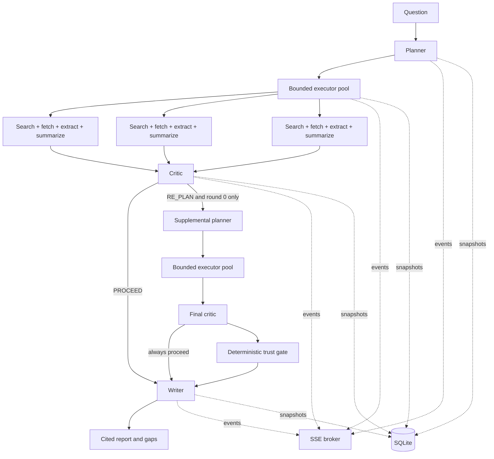

# Architecture

## Runtime flow

The FSM is implemented directly in `internal/orchestrator/state_machine.go`; no agent framework or job queue is involved. `Run.Options.ReplanEnabled` exists only to isolate the no-re-plan benchmark condition. Normal API runs default it to true. The state machine itself enforces the hard bound: a second `RE_PLAN` decision is converted to a forced proceed and carried into report caveats.

The critic is advisory, not the final trust boundary. `enforceCriticDecision` deterministically overrides `PROCEED` when coverage is thin or missing, a finding failed, or no finding fully succeeded. `assessTrust` then assigns `verified`, `qualified`, or `inconclusive` using evidence completeness, independent-domain count, contradictions, and forced-proceed state. The writer receives that assessment and must abstain from confident estimates for inconclusive runs.

## Concurrency and failure boundaries

- A bounded worker pool (default four goroutines) owns sub-question concurrency.
- Each sub-question gets its own 25-second context. Search returns five URLs; fetch/extract runs concurrently inside that task context, then one JSON-mode LLM call summarizes each relevant page into source-preserving evidence. Batching keeps four sub-questions parallel without issuing 20 simultaneous LLM calls.
- Timeouts, rate limits, and 5xx responses receive one retry after 500 ms. 4xx responses and malformed/irrelevant documents do not.
- One usable page produces `partial`; two or more usable pages with no page-pipeline failures produce `success`; zero produces `failed`.
- Findings retain failure text and feed the critic and writer. A failed sub-question never cancels siblings.

## Provider boundaries

Orchestration imports only the `llm.Provider` and `search.Provider` interfaces. Groq, Gemini, SearXNG, and Brave handle their own request/response formats. Groq is primary and Gemini is invoked only when Groq is unconfigured, rate-limited, or returns a 5xx response. SearXNG is the keyless default; `VERITY_SEARCH_PROVIDER=brave` selects the optional hosted API without changing orchestration code.

Structured planner and critic calls request provider JSON mode. Responses are parsed and semantically validated; invalid output receives one corrective retry containing the parse error.

Cost metadata keeps per-call LLM estimates and a separately configured search-request estimate, then reports their sum as the run's paid-tier equivalent. Self-hosted SearXNG defaults to zero marginal API cost; Brave defaults to its current $0.005/request rate. This makes a provider swap require an explicit price update without coupling the state machine to a provider name.

## Search deployment

Docker Compose runs the official SearXNG container on the internal service network and binds its optional browser UI/API to host loopback only. `search/searxng/settings.yml` enables JSON responses and limits general search to keyless DuckDuckGo and Bing engines. The image is pinned by multi-platform digest for reproducibility.

Render uses a combined runtime image: Granian serves SearXNG on `127.0.0.1:8888`, while the Go API alone binds the public Render port. This avoids exposing a reusable search proxy and avoids consuming a second free service. The tradeoff is a larger runtime image and shared process resources. Browser-search engines can throttle automated traffic or change response formats, so this path is zero recurring API cost but less operationally predictable than Brave's paid API.

## Extraction choice

V1 uses a pure-Go extractor built on `golang.org/x/net/html`. It removes navigation, scripts, forms, and other low-value regions, normalizes text, caps response and prompt sizes, and avoids a Python sidecar. This is less sophisticated than `trafilatura`, but it keeps deployment single-process and was the conservative choice before live extraction-quality measurements exist. The fetch transport blocks loopback/private/link-local targets and validates redirects to reduce SSRF risk.

## Persistence and event replay

Each run is stored as one versioned JSON snapshot plus an append-only event table. An SSE connection subscribes before loading prior events, replays stored events in sequence, then ignores buffered duplicates by sequence number. This avoids missing events during the replay/live handoff.

SQLite uses WAL and a five-second busy timeout. Docker Compose mounts `/app/data` as a named volume. Render free web services do not provide durable disks; hosted replay durability therefore requires a paid disk or a later external-store adapter.

The store now has SQLite and Postgres adapters behind the same repository contract. SQLite remains local-first; `VERITY_DATABASE_URL` selects Postgres for durable hosted state. Run deletion cascades to its append-only event records. New lifecycle endpoints support cancellation, retry, deletion, and direct timeline retrieval.

## Runtime controls and observability

The HTTP layer bounds active execution with `VERITY_MAX_ACTIVE_RUNS`; overflow stays queued. A per-client sliding one-minute creation limit protects the expensive run endpoint. An optional shared bearer token is available for controlled demos, while production multi-tenancy still requires an external identity layer and per-user authorization.

`GET /api/status` reports active/tracked capacity. Each run persists stage latency, provider/model calls, tokens, cost, search count, outcome counts, trust assessment, and the full SSE-compatible event trace. Search results and extracted documents use an in-memory 30-minute cache; cache hits do not increment paid search estimates.
