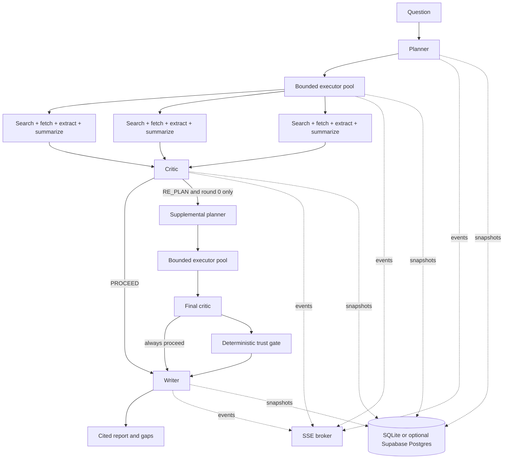

# Architecture

## Runtime flow

The FSM is implemented directly in `backend/verity/orchestrator.py`; no agent framework or job queue is involved. `RunOptions.replan_enabled` exists only to isolate the no-re-plan benchmark condition. Normal API runs default it to true. The state machine itself enforces the hard bound: a second `RE_PLAN` decision is converted to a forced proceed and carried into report caveats.

The critic is advisory, not the final trust boundary. `enforceCriticDecision` deterministically overrides `PROCEED` when coverage is thin or missing, a finding failed, or no finding fully succeeded. `assessTrust` then assigns `verified`, `qualified`, or `inconclusive` using evidence completeness, independent-domain count, contradictions, and forced-proceed state. The writer receives that assessment and must abstain from confident estimates for inconclusive runs.

## Concurrency and failure boundaries

- A bounded `asyncio` semaphore owns sub-question concurrency.
- Each sub-question gets its own 25-second timeout. Search returns five URLs; fetch/extract runs concurrently inside that task, then one JSON-mode LLM call summarizes each relevant page into source-preserving evidence.
- Timeouts, rate limits, and 5xx responses receive one retry after 500 ms. 4xx responses and malformed/irrelevant documents do not.
- One usable page produces `partial`; two or more usable pages with no page-pipeline failures produce `success`; zero produces `failed`.
- Findings retain failure text and feed the critic and writer. A failed sub-question never cancels siblings.

## Provider boundaries

Orchestration depends only on typed `ModelProvider` and `SearchProvider` protocols. Groq, Gemini, SearXNG, and Brave handle their own request/response formats. Groq is primary and Gemini is invoked only when Groq is unconfigured, rate-limited, or returns a 5xx response. SearXNG is the keyless default; `VERITY_SEARCH_PROVIDER=brave` selects the optional hosted API without changing orchestration code.

Structured planner and critic calls request provider JSON mode. Responses are parsed and semantically validated; invalid output receives one corrective retry containing the parse error.

Cost metadata keeps per-call LLM estimates and a separately configured search-request estimate, then reports their sum as the run's paid-tier equivalent. Self-hosted SearXNG defaults to zero marginal API cost; Brave defaults to its current $0.005/request rate. This makes a provider swap require an explicit price update without coupling the state machine to a provider name.

## Search deployment

Docker Compose runs the official SearXNG container on the internal service network and binds its optional browser UI/API to host loopback only. `search/searxng/settings.yml` enables JSON responses and limits general search to keyless DuckDuckGo and Bing engines. The image is pinned by multi-platform digest for reproducibility.

Render uses a combined runtime image: Granian serves SearXNG on `127.0.0.1:8888`, while Uvicorn exposes only the FastAPI service on Render's public port. This avoids exposing a reusable search proxy and avoids consuming a second service. Browser-search engines can throttle automated traffic or change response formats, so this path is zero marginal API cost but less operationally predictable than Brave's paid API.

## Extraction choice

The Python extractor uses `httpx` and Beautiful Soup. It removes navigation, scripts, forms, and other low-value regions, normalizes text, and caps response and prompt sizes. DNS and redirect targets are checked to block loopback, private, and link-local destinations and reduce SSRF risk.

## Persistence and event replay

Each run is stored as one versioned JSON snapshot plus an append-only event table. An SSE connection subscribes before loading prior events, replays stored events in sequence, then ignores buffered duplicates by sequence number. This avoids missing events during the replay/live handoff.

SQLite uses WAL and a five-second busy timeout and is the current runtime. The repository also includes an optional Supabase-ready Postgres adapter targeting a private `verity` schema. Its migration enables RLS with no client policies and grants `anon`/`authenticated` no schema, table, or sequence privileges, so only a configured server connection could persist or replay runs.

Async SQLite and Postgres adapters implement the same repository protocol. `VERITY_DATABASE_URL` selects the optional Postgres path; without it, Verity uses SQLite. Run deletion cascades to append-only events. Lifecycle endpoints support cancellation, retry, deletion, and direct timeline retrieval.

## Runtime controls and observability

The HTTP layer bounds active execution with `VERITY_MAX_ACTIVE_RUNS`; overflow stays queued. A per-client sliding one-minute creation limit protects the expensive run endpoint. An optional shared bearer token is available for controlled demos, while production multi-tenancy still requires an external identity layer and per-user authorization.

`GET /api/status` reports active/tracked capacity. Each run persists stage latency, provider/model calls, tokens, cost, search count, outcome counts, trust assessment, and the full SSE-compatible event trace. Search results and extracted documents use an in-memory 30-minute cache; cache hits do not increment paid search estimates.

## Public deployment boundary

Browser requests stay same-origin through the Next.js catch-all route handler. That server-only proxy injects the backend bearer token and streams upstream SSE bodies without buffering. Vercel stores `VERITY_API_URL` and `VERITY_API_TOKEN` as encrypted server environment variables; neither is compiled into the browser bundle. The backend is the compute boundary and SQLite is the current persistence boundary. A private Supabase schema would replace SQLite only when `VERITY_DATABASE_URL` is configured.
